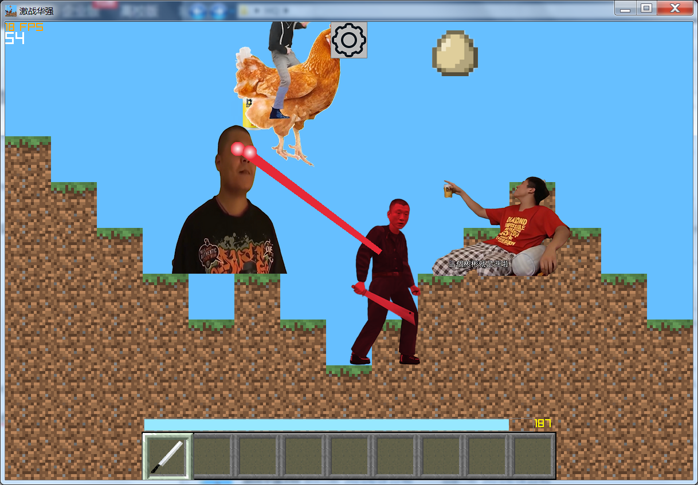
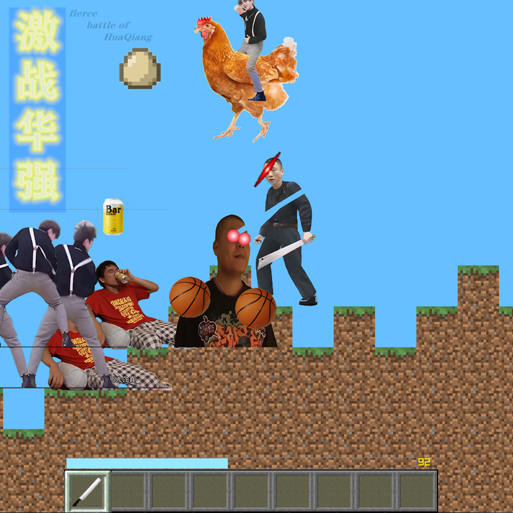

# 激战华强-自制小游戏
*Github仓库：https://github.com/MackyinSU/HQ/*

*中国国内仓库gitee：https://gitee.com/mackyinsuSU/HQ*

*视频：https://www.bilibili.com/video/BV1j8411z7oT*
# 介绍
激战华强-自制小游戏 
使用【Raylib】图形库制作的鬼畜·游戏（图形库官网www.raylib.com）

* 好玩解压的打法，快来van♂游戏 *

* 4个丰富多彩的鬼畜人物让你欲罢不能(114514) *

* 独特的模（抄）仿（袭）mc风格地形，物品栏……，让mc玩家眼前一亮（黑）【doge】【doge】*

总之，这是一个好康的新游戏。疑一时，误一世，疑久疑久罢宜龄！还犹豫什么？下载下来尝尝鲜吧！

# 安装教程
最新版本下载地址：https://macky.lanzoum.com/ilyny16sg36b （密码password：0829）*或* 在发行版中下载想要的版本
资源包是hq文件夹

1.0版本解压后运行里面的exe文件

1.01版本运行安装程序，按照指示进行安装操作

# 使用方法： 
1，按下D前进，A后退，W或空格键跳跃

2，使用鼠标滚轮或数字按键（类似mc）进行物品栏物品的选取

3，鼠标左键是攻击，当物品栏光标选中食物时，长按鼠标右键可以回血

4，左上角白色数字是玩家的地图坐标，当地图坐标小于0是为超平坦地形，用来打野+训练（总之就是休闲），终点位于x=1500（在悬崖之下，跳下去后不会收到摔落伤害），到达后玩家即可胜利，若在这之前死亡则失败，可重新来（但暂不支持复活）

5，NPC死亡后会掉落食物，食物可以回血，食物需要自己拾取

6，NPC有各自的技能，比如阿伟投掷的啤酒瓶会导致玩家有3秒的喝醉效果（表现为键盘反转与绿色滤镜）且阿伟会在杰哥死亡后会发出呐喊，玩家若处于威力圈中会受伤，杰哥为激光眼（让我看看！），cxk为打篮球（攻击玩家）+下蛋攻击

7，点击正上方的齿轮图标 或 按下P键可以暂停+调节音量+回到主界面

8，游戏音效做的不是很完善，如果有兴趣可下载源代码自己加入更多音效

10，跳劈会增加20的攻击伤害

11，吃鸡肉和喝酒耗费2秒钟左右，吃面包1秒左右，回血能力（即单次食用可恢复的血量）：酒>鸡肉>面包，但酒喝下去后有1/3的概率获得喝醉效果（持续时间3s）

游戏有很多好康的，欢迎游玩！
**

# 注意
** ： 程序是在win7上开发的，目前仅支持Windows x64平台 如果你的Windows版本大于win7，且点击之后没有反应，请使用兼容模式打开（具体可以上浏览器搜搜如何使用兼容模式打开软件） 

这只是1.0版本，未来除了加入更丰富的玩法和音效以及进行优化外，我还决定加入更多鬼畜角色以及枪械系统

# 鸣谢
HJQ：纹理制作

Hidrag：帮助编写

华强素材：https://www.bilibili.com/video/BV1o64y1h7Ck/

杰哥+阿伟素材：https://www.bilibili.com/video/BV14r4y127he/

另外还使用了很多UP主提供的素材，在此表达感谢！如果您看到后，请及时联系我并附上视频出处
